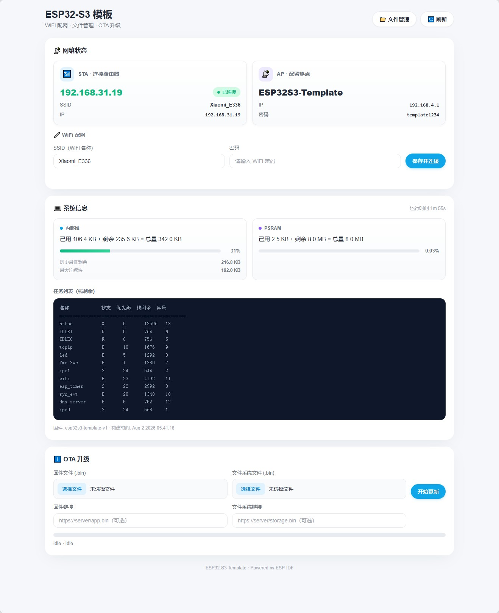
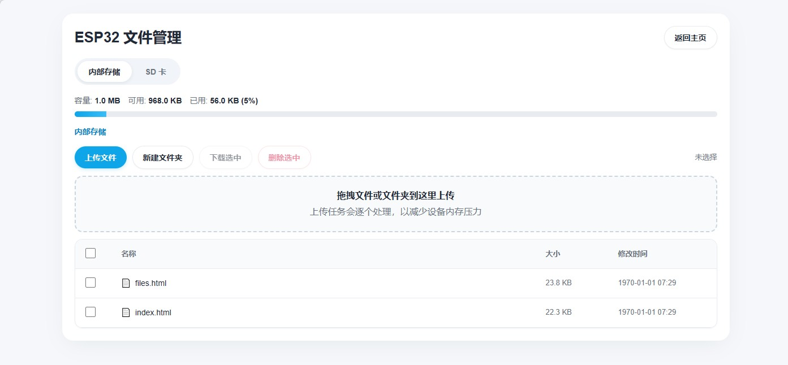

# ESP32-S3 通用模板

基于 ESP32-S3 的基础设施模板，提供 WiFi 配网、文件系统、SD 卡、OTA 升级等开箱即用的功能。适合作为新项目的起点。

## 功能一览

| 功能 | 说明 |
|------|------|
| **WiFi AP+STA** | 同时运行 AP 热点（`ESP32S3-Template`）和 STA 客户端 |
| **Web 配网** | 网页端输入 SSID/密码，配置持久化到 LittleFS，自动重连 |
| **Captive Portal** | DNS 劫持，手机连上 AP 后自动弹出配网页面 |
| **LittleFS** | 1 MB 内部闪存文件系统，存放网页和配置文件 |
| **SD 卡（可选）** | 独立 SPI/FAT 驱动；默认固件不初始化、不占用 SD GPIO |
| **文件管理器** | Web 界面浏览/上传/下载/删除/新建文件夹，支持内部 Flash 和 SD 卡双存储 |
| **OTA 升级** | 支持固件 + 文件系统远程升级，也支持网页直接上传刷写 |
| **SD 日志（可选）** | 独立的 ESP_LOG 双写组件；默认固件不初始化、不接管全局日志输出 |
| **SNTP 授时** | STA 连接成功后自动同步北京时间（ntp.aliyun.com） |
| **LED 心跳** | `main` 显式启用独立 LED 组件，绿灯以 2 Hz、50% 占空比持续闪烁 |
| **调试接口** | `/debug.json` 查看堆内存、PSRAM、任务列表、运行时间 |

## 界面预览





## 硬件接线

### LED（低电平点亮）

默认 `app_main()` 会显式初始化 `led_task`，因此以下四个 GPIO 都会由 LED 组件配置；绿灯作为心跳灯，以 500 ms 周期、250 ms 点亮时间持续闪烁。

| LED | GPIO |
|-----|------|
| 红  | IO15 |
| 黄  | IO7  |
| 绿  | IO6  |
| 蓝  | IO5  |

### SD 卡（SPI 模式）

| 信号 | GPIO |
|------|------|
| MOSI | IO11 |
| SCLK | IO12 |
| MISO | IO13 |
| CS   | IO10 |
| CD   | IO14 |

## 网页端点

| 路径 | 说明 |
|------|------|
| `/` | 仪表盘首页（WiFi 状态、配网表单、系统信息） |
| `/files` | 文件管理器 |
| `/files.html` | 文件管理器（独立页面） |
| `/network.json` | 网络状态 JSON |
| `/wifi_config.json` | WiFi 配置读写（GET/POST） |
| `/debug.json` | 系统调试信息 |
| `/ota/status` | OTA 升级状态 |
| `/ota/start` | 触发远程 OTA（POST JSON） |
| `/ota/upload/firmware` | 上传固件刷写 |
| `/ota/upload/filesystem` | 上传文件系统镜像 |
| `/api/fs` | 文件管理 API（list/download/delete/mkdir/upload） |
| `/hello` | Hello World 示例端点（自定义业务模板） |

## 快速开始

```bash
# 1. 克隆或复制此模板
cp -r esp32s3_template my_project && cd my_project

# 2. （可选）把 WiFi 凭据预置到 LittleFS 数据镜像
cp main/wifi_config.example.json data/wifi_config.json
# 编辑 data/wifi_config.json；该文件已被 git 忽略

# 3. 编译烧录
idf.py set-target esp32s3
idf.py build
idf.py -p COMx flash monitor
```

## 首次使用

设备启动后：

- **无 WiFi 配置**：手机会搜到热点 `ESP32S3-Template`（密码 `template1234`），连接后浏览器打开任意网址自动跳转配网页面
- **已配置 WiFi**：设备自动连接路由器，查看路由器后台获取 IP，浏览器访问即可

## 项目结构

```
├── CMakeLists.txt
├── partitions.csv              # OTA 分区表 (app×2 + LittleFS)
├── sdkconfig.defaults          # ESP-IDF 默认配置
├── main/                       # 应用层（基础设施编排 + 业务端点）
│   ├── main.c                  # 入口：LittleFS → LED心跳 → WiFi配置 → WiFi → Web
│   ├── app_storage.c/.h        # 应用存储所有者：挂载 LittleFS
│   ├── wifi_config_store.c/.h  # WiFi 凭据 JSON 读写（应用层）
│   ├── web_platform.c/.h       # HTTP 服务器 + 页面路由 + Web 组件编排
│   ├── hello_web.c/.h          # ★ 自定义 HTTP 端点模板（从这里开始写业务）
│   └── wifi_config.example.json
├── data/
│   ├── index.html              # 仪表盘首页
│   └── files.html              # 文件管理器页面
└── components/
    ├── wifi_manager/           # WiFi APSTA + 可选 DNS/SNTP（启动策略由调用方传入）
    ├── ota_manager/            # OTA 状态机 + 下载刷写 + 上传逻辑
    ├── file_manager/           # Web 文件管理器 API
    ├── led_task/               # 独立四路 LED 驱动（main 默认启用绿灯心跳）
    ├── sd_card/                # SD 卡 SPI 驱动
    ├── sd_logger/              # 可选日志双写组件（默认未启用）
    └── json/                   # cJSON 辅助组件
```

## 添加自己的业务

项目采用 **平台 + 业务** 分层架构：

1. `main/main.c` — 启动编排，先挂载 LittleFS、加载 JSON，再把凭据传给 WiFi
2. `main/web_platform.c` — HTTP / OTA / 配网 / 仪表盘
3. `main/hello_web.c/.h` — 业务端点模板，从这里开始写你的 HTTP handler

**三步添加自定义端点：**

```c
// 1. 在 hello_web.c 中仿照 hello_handler() 写你的 handler
// 2. 在 hello_web_register() 中注册新的 URI
// 3. main.c 中的注册流程已就绪：
//    web_platform_init()
//    hello_web_register(web_platform_get_server())   // ← 你的业务
//    web_platform_register_static_fallback()          // 必须最后
```

**更复杂的场景**：直接在 `components/` 下新建独立组件，在 `main/CMakeLists.txt` 中添加依赖即可。

**可复用模块**（`wifi_manager` / `ota_manager` / `file_manager` / `led_task` / `sd_card` / `sd_logger`）位于 `components/`，由应用层按需选择和编排。

### WiFi 凭据边界

默认启动流程先挂载 LittleFS，再由应用层把 `/littlefs/wifi_config.json` 读入 `wifi_manager_config_t.sta`，最后把完整启动配置传给 `wifi_manager_init()`。STA 凭据使用独立的 `wifi_manager_credentials_t`，网页运行时配网只能更新 STA，不会覆盖 AP、DNS 或 SNTP 策略。WiFi 组件本身不读取文件、不解析 JSON，也不支持 `wifi_config.h` 宏配置。

AP 名称和密码、信道、最大客户端数、是否启用 captive-portal DNS 以及 SNTP 服务器均在 `main/main.c` 的启动配置中给出，应用可在初始化前直接调整，无需修改 `wifi_manager` 组件。

LittleFS 的挂载和并发访问统一由应用层 `app_storage` 管理。文件系统 OTA 只接收应用传入的分区标签和“卸载/重挂载”回调，`ota_manager` 不再自行依赖 LittleFS；配置保存、静态文件和文件管理请求与 OTA 擦写使用同一存储租约，避免同时访问底层分区。

WiFi 配置更新采用“临时文件写入并同步 → 应用运行时配置 → 原子重命名提交”的事务顺序。提交或回滚异常时会停用 STA 重连并保留配网 AP。若 LittleFS 在启动或文件系统 OTA 后无法挂载，固件仍会启动 AP 和 OTA 接口，根页面会提供内置的文件系统镜像恢复入口，不需要先重新烧录整机固件。

未预置 JSON 时设备会启动配网 AP；也可以通过 Web 配网页面保存凭据。若需要在固件镜像中预置，复制并编辑 JSON 示例即可：

```bash
cp main/wifi_config.example.json data/wifi_config.json
```

### 可选启用 SD 卡

默认固件不会初始化 `sd_card`。需要文件管理器访问 SD 卡时，在 `main/CMakeLists.txt` 的 `REQUIRES` 中添加 `sd_card`，然后在 `web_platform_init()` 之前显式初始化：

```c
#include "sd_card.h"

esp_err_t sd_err = sd_card_init();
if (sd_err != ESP_OK) {
    ESP_LOGW(TAG, "SD card init failed: %s", esp_err_to_name(sd_err));
}
```

文件管理器的内部存储分区、内部挂载点和可选 SD 挂载点由应用层传入；未挂载 SD 时只会报告该后端不可用。

### 可选启用 SD 日志

默认固件不会初始化 `sd_logger`，WiFi、Web 等平台组件也不依赖它。需要日志双写时，由用户在自己的启动编排中显式依赖 `sd_logger`，并在 `sd_card_init()` 成功后调用 `sd_logger_init()`；如需在 SNTP 同步后切换时间戳文件名，可由用户自己的事件处理器调用 `sd_logger_notify_time_synced()`。

### LED 组件边界

`wifi_manager` 和 `web_platform` 均不依赖 LED。默认应用只在 `main/main.c` 中显式选择 `led_task` 并启动绿灯心跳：

```c
#include "led_task.h"

ESP_ERROR_CHECK(led_task_init());

const led_cmd_t heartbeat = {
    .led = LED_GREEN,
    .type = LED_CMD_BLINK,
    .period_ms = 500u,
    .on_ms = 250u,
};
led_send_cmd(&heartbeat);
```

如需关闭默认心跳，可从 `main` 移除初始化和 `led_task` 构建依赖；如需用 LED 表示网络状态，可在应用层注册 ESP-IDF 的 `WIFI_EVENT` / `IP_EVENT` 处理器后发送 LED 命令，无需修改或反向依赖 `wifi_manager`。

模板已为你处理好了 WiFi、存储、Web 服务等基础设施，你只需关注自己的业务逻辑。
